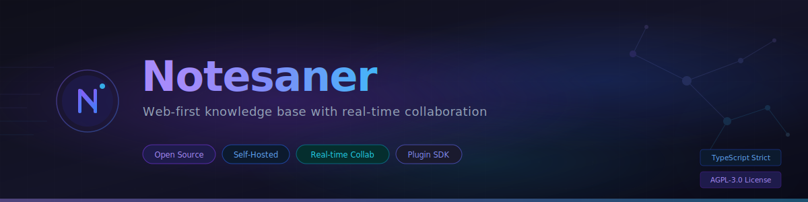
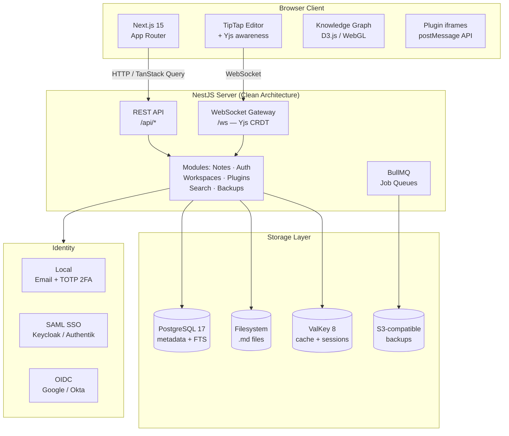

<p align="center">
  
</p>

<p align="center">
  <a href="https://github.com/notesaner/notesaner/blob/main/LICENSE"></a>
  <a href="https://github.com/notesaner/notesaner/actions/workflows/ci.yml"></a>
  <a href="https://github.com/notesaner/notesaner/releases"></a>
  
  
  
  
</p>

<p align="center">
  <strong>A self-hosted, web-first note-taking platform with real-time collaboration, a plugin system, and Markdown as the source of truth.</strong><br/>
  Think Obsidian — but multi-user, browser-native, and free to self-host.
</p>

---

## Why Notesaner?

| Pain Point          | Others                       | Notesaner                                   |
| ------------------- | ---------------------------- | ------------------------------------------- |
| No web version      | Obsidian desktop-only        | Web-first, no install needed                |
| No real-time collab | Obsidian lacks native collab | Yjs CRDT — conflict-free multi-user editing |
| Expensive sync      | Obsidian $4–8/mo             | Free with self-hosting                      |
| SSO behind paywall  | Notion $20/user/mo for SAML  | SAML & OIDC included                        |
| Plugin fragility    | Plugins break on update      | Sandboxed plugins with stable SDK           |
| Weak search         | Keyword-only                 | PostgreSQL FTS + fuzzy trigram              |

---

## Features

### Editor & Notes

- **Rich block editor** — TipTap/ProseMirror with slash commands, floating toolbar, and live preview
- **Markdown-first** — `.md` files on the filesystem are always the source of truth
- **Full Obsidian syntax** — `[[wiki-links]]`, `![[embeds]]`, `[[note#^block]]` references
- **Bi-directional links** — backlinks panel, unlinked mentions, hover previews
- **Version history** — full snapshots with diffs for every note

### Collaboration

- **Real-time sync** — Yjs CRDT over WebSocket; edits merge conflict-free
- **Multi-cursor presence** — see teammates' cursors and selections live
- **Threaded comments** — per-selection comments with resolved/unresolved state
- **Workspaces** — isolated vaults with role-based access (Owner, Admin, Editor, Viewer)

### Knowledge Graph

- **Interactive graph** — D3.js force-directed graph with WebGL rendering for large vaults
- **Persistent layouts** — save and restore graph positions
- **Zettelkasten** — typed links, semantic clustering, create links by drawing edges

### Plugin System

- **15 bundled plugins** — AI assistant, Kanban, Calendar, Daily Notes, Database views, Excalidraw, Focus mode, Graph view, Mermaid, PDF export, Slides, Spaced repetition, Templates, Web clipper, Backlinks panel
- **Plugin SDK** — iframe sandbox with `postMessage` API and stable versioned surface
- **GitHub-based registry** — install community plugins with one click

### Operations

- **Self-hosting** — Docker Compose production stack with Nginx, TLS, and HTTP/2
- **Auth** — local email/password + TOTP 2FA, SAML SSO (Keycloak, Authentik, Azure AD), OIDC SSO
- **Automated backups** — PostgreSQL + filesystem, AES-256 encryption, S3-compatible off-site storage
- **Observability** — OpenTelemetry tracing, Prometheus metrics, Grafana dashboards, Loki logging

---

## Tech Stack

<p align="center">
  
  
  
  
  
  <br/>
  
  
  
  
  <br/>
  
  
  
  
</p>

| Layer         | Technology                                                                                     |
| ------------- | ---------------------------------------------------------------------------------------------- |
| Frontend      | Next.js 15 (App Router), React 19, TipTap, Ant Design, Tailwind CSS 4, Zustand, TanStack Query |
| Backend       | NestJS 11, Prisma 6, PostgreSQL 17, ValKey 8 (Redis-compatible)                                |
| Real-time     | Yjs CRDT via WebSocket (`y-websocket`)                                                         |
| Monorepo      | NX 22, pnpm 10                                                                                 |
| Testing       | Vitest (unit/integration), Playwright (E2E)                                                    |
| Observability | OpenTelemetry, Prometheus, Grafana, Loki                                                       |
| CI/CD         | GitHub Actions, Docker                                                                         |

---

## Architecture



### Key Design Decisions

| Concern                   | Approach                                                                     |
| ------------------------- | ---------------------------------------------------------------------------- |
| **Frontend architecture** | Feature-Sliced Design (app → pages → widgets → features → entities → shared) |
| **Backend architecture**  | Clean Architecture — modules → services → repositories                       |
| **Real-time sync**        | Yjs CRDT; Markdown file is always the authoritative source                   |
| **Plugin isolation**      | iframe sandbox + `postMessage`; plugins cannot access host DOM               |
| **Search**                | PostgreSQL FTS with `pg_trgm` extension for fuzzy matching                   |
| **Event system**          | CQRS + domain events for decoupled side-effects                              |

---

## Quick Start

### Option A: Docker Compose (Recommended)

```bash
# 1. Clone
git clone https://github.com/notesaner/notesaner.git
cd notesaner

# 2. Configure environment
cp docker/.env.example docker/.env
# Edit docker/.env — set DOMAIN, passwords, JWT_SECRET

# 3. Add TLS certificates
mkdir -p docker/nginx/certs
# Copy fullchain.pem and privkey.pem into docker/nginx/certs/

# 4. Start services
docker compose -f docker/docker-compose.prod.yml --env-file docker/.env up -d

# 5. Run migrations
docker compose -f docker/docker-compose.prod.yml exec server \
  npx prisma migrate deploy --schema=./prisma/schema.prisma
```

Your instance will be live at `https://<your-domain>`.

### Option B: Local Development

**Prerequisites:** Node.js ≥ 22, pnpm ≥ 10, Docker

```bash
# 1. Clone and install
git clone https://github.com/notesaner/notesaner.git
cd notesaner
pnpm install

# 2. Start PostgreSQL + ValKey
pnpm docker:up

# 3. Configure environment
cp apps/server/.env.example apps/server/.env  # set JWT_SECRET
cp .env.example .env

# 4. Set up database
pnpm db:generate
pnpm db:migrate

# 5. Start dev servers
pnpm dev
# Frontend → http://localhost:3000
# Backend  → http://localhost:4000
```

---

## Project Structure

```
notesaner/
├── apps/
│   ├── web/                    # Next.js 15 frontend (App Router)
│   │   ├── app/                #   Routing layer
│   │   ├── src/                #   Feature-Sliced Design layers
│   │   │   ├── app/            #     Application-wide setup & providers
│   │   │   ├── pages/          #     Page compositions
│   │   │   ├── widgets/        #     Self-contained UI blocks
│   │   │   ├── features/       #     User interaction units
│   │   │   ├── entities/       #     Business entity UI & models
│   │   │   └── shared/         #     Utilities, UI primitives, config
│   │   └── playwright/         #   E2E tests
│   ├── server/                 # NestJS 11 backend
│   │   ├── src/modules/        #   Feature modules
│   │   └── prisma/             #   Schema, migrations, seed
│   └── docs/                   # Docusaurus documentation site
├── libs/
│   ├── contracts/              # Shared TypeScript types, DTOs, API contracts
│   ├── constants/              # Enums and constants
│   ├── editor-core/            # TipTap configuration and custom extensions
│   ├── sync-engine/            # Yjs CRDT synchronization logic
│   ├── markdown/               # Markdown parser and renderer
│   ├── plugin-sdk/             # Plugin development SDK
│   └── query-factory/          # TanStack Query wrapper factory
├── packages/
│   ├── ui/                     # Shared UI component library (Storybook)
│   ├── plugin-ai/              # AI assistant
│   ├── plugin-kanban/          # Kanban board
│   ├── plugin-calendar/        # Calendar & daily notes
│   ├── plugin-excalidraw/      # Excalidraw drawings
│   ├── plugin-graph/           # Knowledge graph
│   ├── plugin-database/        # Database views
│   └── ...                     # 15 bundled plugins total
├── docker/                     # Production Docker configs + Nginx
├── docker-compose.yml          # Dev services (Postgres + ValKey)
├── docker-compose.monitoring.yml # Prometheus + Grafana + Loki
└── nx.json                     # NX workspace configuration
```

---

## Available Commands

```bash
# Development
pnpm dev                        # Start frontend + backend dev servers
pnpm dev:web                    # Next.js only (port 3000)
pnpm dev:server                 # NestJS only (port 4000)

# Build & test
pnpm nx build <project>         # Build a specific project
pnpm nx test <project>          # Unit tests for a project
pnpm nx affected -t test        # Test only changed projects
pnpm lint                       # Lint all projects
pnpm type-check                 # Type-check all projects

# Database
pnpm db:generate                # Generate Prisma client
pnpm db:migrate                 # Run migrations (dev)
pnpm db:studio                  # Open Prisma Studio

# Docker
pnpm docker:up                  # Start dev services
pnpm docker:down                # Stop dev services

# Utilities
pnpm storybook                  # Component library (Storybook)
pnpm nx graph                   # Visualize NX dependency graph
```

---

## Self-Hosting Requirements

| Resource       | Minimum       | Recommended |
| -------------- | ------------- | ----------- |
| CPU            | 2 cores       | 4 cores     |
| RAM            | 2 GB          | 4 GB        |
| Disk           | 10 GB + notes | 40 GB SSD   |
| Docker         | 24.0+         | Latest      |
| Docker Compose | v2.20+        | Latest      |

See the [Self-Hosting Guide](apps/docs/dev/self-hosting/overview.md) and [full env-var reference](apps/docs/dev/self-hosting/env-vars.md) for detailed instructions on TLS, SSO, backups, and upgrades.

---

## Contributing

Contributions are welcome. Here's how to get started:

1. **Fork** the repo and create your branch from `main`
2. **Install** dependencies: `pnpm install`
3. **Follow** the standards:
   - TypeScript strict mode
   - Conventional commits (`feat:`, `fix:`, `chore:`, `docs:`)
   - Feature-Sliced Design on the frontend
   - Zod for runtime validation at system boundaries
4. **Test** your changes: `pnpm lint && pnpm type-check && pnpm test`
5. **Open a PR** with a clear description

See [Contributing Guide](apps/docs/dev/contributing/overview.md) for full details, including code standards, testing requirements, and PR process.

---

## Documentation

Full documentation is available in [`apps/docs/`](apps/docs/):

| Section                                                                               | Description                             |
| ------------------------------------------------------------------------------------- | --------------------------------------- |
| [Dev Setup](apps/docs/dev/contributing/dev-setup.md)                                  | Local development environment           |
| [Architecture](apps/docs/dev/architecture/monorepo.md)                                | System design and diagrams              |
| [API Reference](apps/docs/dev/api-reference/overview.md)                              | REST API endpoints and WebSocket events |
| [Plugin Development](apps/docs/dev/plugin-development/getting-started/hello-world.md) | Build your first plugin                 |
| [Self-Hosting](apps/docs/dev/self-hosting/overview.md)                                | Production deployment guide             |
| [Component Library](apps/docs/dev/component-library/overview.md)                      | UI component reference                  |

---

## License

Licensed under the [GNU Affero General Public License v3.0 (AGPL-3.0)](https://www.gnu.org/licenses/agpl-3.0.html).

This means: you can use, modify, and self-host Notesaner freely. If you distribute a modified version or offer it as a service, you must release your modifications under the same license.
