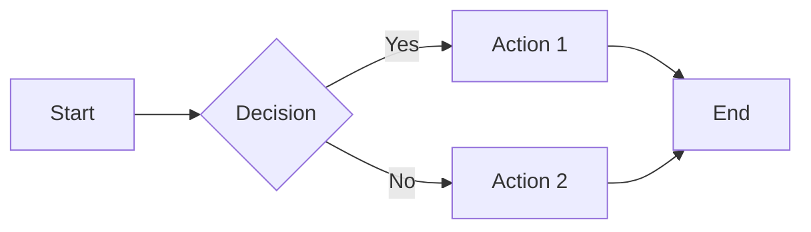

# Diagrams (Mermaid)

The Mermaid plugin automatically renders Mermaid code blocks as interactive diagrams.

## Supported Diagram Types

- Flowcharts
- Sequence diagrams
- Gantt charts
- Class diagrams
- State diagrams
- Entity-relationship diagrams
- Git graphs
- Mind maps

## Usage

Create a code block with the `mermaid` language:

````markdown

````

## Exporting Diagrams

Click a rendered diagram and select **Export as PNG** or **Export as SVG**.
